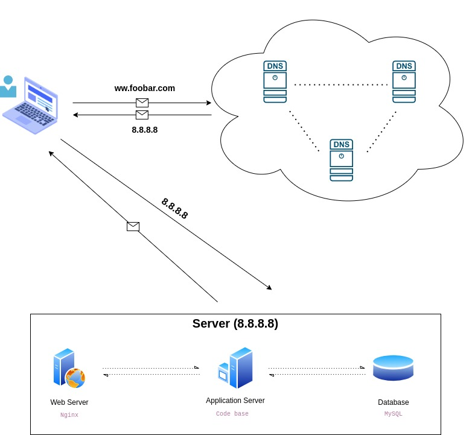

# Simple Web Stack

[Visit Board](https://i.imgur.com/jXlg1qw.jpg)

## Description

This web infrastructure is uncomplicated and serves as the host for a website accessible through the domain "www.foobar.com." It does not employ firewalls or SSL certificates to safeguard the server's network. The server's resources, including CPU, RAM, and SSD, are distributed among its components, which include the database and application server. These components share the available resources to fulfill their respective functions.

## Specifics About This Infrastructure

+ What a server is. A server refers to either computer hardware or software that offers services to other computers, commonly known as "clients.".

- The purpose of assigning a human-friendly alias to an IP Address is to provide a more recognizable and memorable identifier. For example, the domain name "www.wikipedia.org" is easier to remember and recognize than the numeric IP address "91.198.174.192". The Domain Name System (DNS) facilitates the mapping between IP addresses and domain name aliases.

- The DNS record type used for the subdomain "www" in "www.foobar.com" is an **A record**. This can be confirmed by running the command `dig www.foobar.com`. It's important to note that the specific results may vary, but for the infrastructure in this design, an A record is utilized. An A record, also known as an Address Mapping record, stores a hostname along with its corresponding IPv4 address.

- The role of the web server is to accept requests through HTTP or HTTPS and provide the requested resource's content or an error message in response.

- The application server's role is to install, operate, and host applications and related services for end users, IT services, and organizations. It enables the hosting and delivery of sophisticated consumer or business applications.

- The database's role is to maintain a well-organized collection of information that can be easily accessed, managed, and updated.

- The server communicates with the client (the user's computer requesting the website) over the internet network using the TCP/IP protocol suite.

## Issues With This Infrastructure

- There are multiple Single Points of Failure (SPOF) in this infrastructure. For instance, if the MySQL database server goes offline, it would result in the entire site being inaccessible.

- Downtime during maintenance: When performing maintenance checks on any component, they need to be taken offline or the server has to be turned off. Since there is only one server, this would cause a downtime for the website.

- Limited scalability under high traffic: Scaling this infrastructure becomes challenging due to the consolidation of components on a single server. The server can quickly become resource-constrained or experience performance degradation when facing a significant influx of requests.

