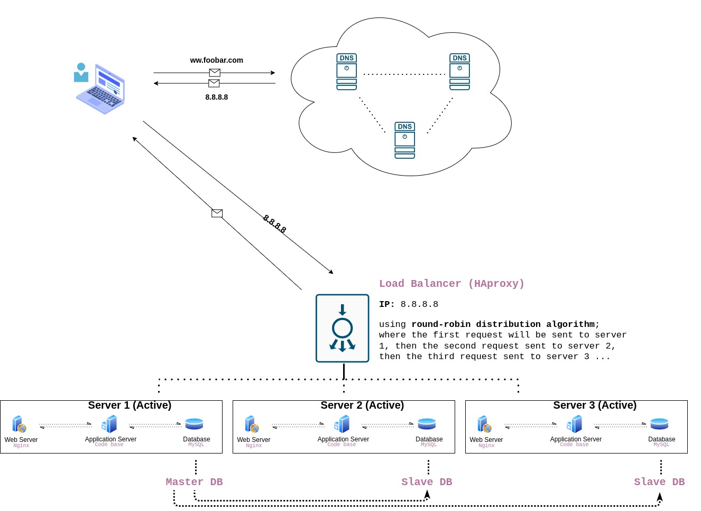

# Distributed Web Infrastructure

[Visit Board](https://i.imgur.com/T7BJGzB.jpg)

## Description

This is a distributed web infrastructure that aims to minimize the traffic on the primary server by distributing a portion of the load to a replica server. This is accomplished through the utilization of a load balancer responsible for evenly distributing the workload between the primary and replica servers.

## Specifics About This Infrastructure

- The load balancer is configured with the *Round Robin* distribution algorithm, which evenly distributes the workload among the servers. This algorithm ensures fair processing time and allows for dynamic adjustments of server weights.

- The load balancer enables an *Active-Passive* setup, distributing workloads to an active node while other nodes remain passive. This setup improves throughput and response times by utilizing multiple nodes.

- In a *Primary-Replica* database cluster, one server acts as the *Primary* for read and write operations, while the other server serves as a *Replica* for read operations. Data synchronization occurs when the *Primary* executes write operations.

- The *Primary* node handles write operations, while the *Replica* node primarily handles read operations, reducing read traffic to the *Primary* node.

## Issues With This Infrastructure

- There are multiple Single Points of Failure (SPOF) in this infrastructure. If the Primary MySQL database server goes down, the entire site will be unable to perform changes, such as adding or removing users. The server hosting the load balancer and the application server are also potential SPOFs.

- Security issues arise from the absence of SSL encryption for network data, leaving it vulnerable to interception by hackers. Additionally, the lack of a firewall on any server means no protection against unauthorized IP addresses.

- The absence of monitoring makes it difficult to determine the status of each server as there is no monitoring system in place.
