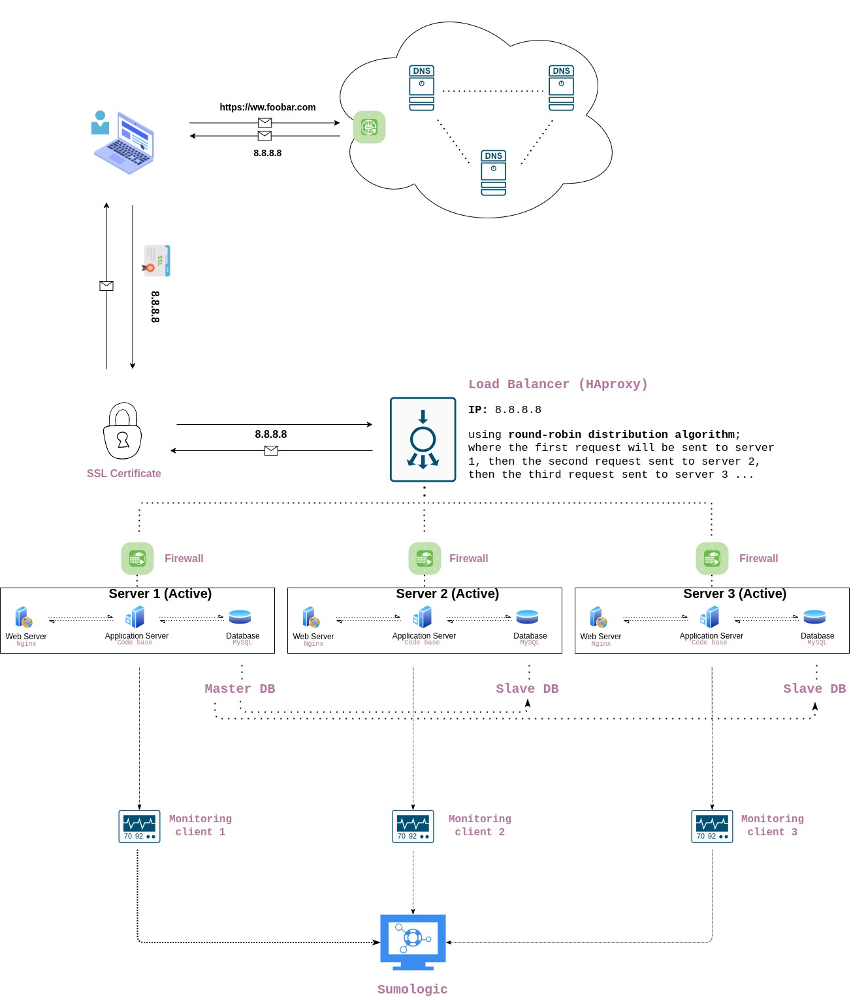

# Secured and Monitored Web Infrastructure

[Visit Board](https://i.imgur.com/YhFh0VL.jpg)

## Description

This infrastructure comprises three web servers focused on security, monitoring, and encrypted traffic.

## Specifics About This Infrastructure

- The role of firewalls is to protect the network (specifically the web servers) by acting as intermediaries between the internal and external networks. They block incoming traffic that meets unauthorized criteria.

- SSL certificates encrypt the traffic between the web servers and the external network, preventing man-in-the-middle attacks and network sniffing. They ensure privacy, integrity, and identification.

- Monitoring clients are responsible for observing and analyzing the servers and the external network. They monitor performance, overall health, and promptly alert administrators in case of issues.

## Issues With This Infrastructure

- Terminating SSL at the load balancer level would leave the traffic between the load balancer and the web servers unencrypted.

- Having a single MySQL server limits scalability and creates a potential single point of failure.

- The use of servers with the same components leads to resource contention and performance issues. Scalability and problem identification become challenging.
